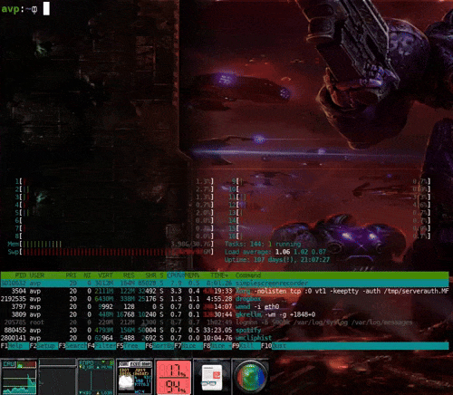

# Linux Tools and Scripts

This document provides an overview of various scripts available in this repository.

## Linux System Utilities

| Script            | Description                                                                 |
|:------------------|-----------------------------------------------------------------------------|
| **freemem**       | Basic tool for freeing swap and caches; restores memory to the state after boot. |
| **memof**         | Returns a memory summary of all threads of an application.                  |
| **usbreboot**     | Restarts corrupted USB interfaces of the operating system.                  |
| **snapdetector**  | Identifies possible Snap packages included in the APT repository.           |
| **psaux**         | Returns only the main command and PID; also searches for similar processes. |
| **testdisk**      | Basic hard drive or SSD benchmark.                                          |
| **ddtest**        | Benchmarking tool for `dd`.                                                 |
| **scanhosts**     | Scans devices in the local network or network segment.                      |
| **fanstatus**     | Returns the current RPM of the system fan.                                  |
| **bluetooth**     | Enables/disables basic rfkill for Bluetooth.                                |
| **build_pkg**     | Utility for building Debian `.deb` packages using `checkinstall`.           |
| **cpfromfile**    | Utility for copying files from a specified list.                            |
| **gitrev**        | Returns revision and version names of the current repository.               |
| **ikvpn**         | Utility for manual operations over an OpenVPN connection.                   |
| **jsonlint**      | Validates a JSON file locally.                                              |
| **x11sockets**    | Lists the current X11 sockets used by each application.                     |
| **pidgrep**       | Returns only the PIDs of all threads of an application.                     |
| **verifydebfiles**| Checks signature hashes of Debian packages.                                 |
| **osdetect**      | Returns the platform architecture and OS name.                              |
| **apt-check**     | Check pending apt updates via email mutt client. (cron utility)             |

| |
|:-------------------------------------------------------------------:|
||
| freemem utility |

## Windowmaker Utilities

| Script                | Description                                                                 |
|:----------------------|-----------------------------------------------------------------------------|
| **loaddocks**         | Loads docks and applications called from GNUStep autostart.                 |
| **sshdocs**           | Loads specific docks for SSH connections.                                   |
| **loadterminators**   | Loads Terminator terminals in fixed positions.                              |
| **btvol**             | Utility for adjusting Bluetooth sink volume.                                |
| **brightness_touchpanel** | Utility for adjusting touch panel brightness (Asus dual-screen laptop). |
| **virtual_screens**   | Adds virtual screens using `xrandr` combined with `xvnc` [^1].              |
| **kben/kbes**        | Toggles keyboard keymap.                                                     |
| **kbcheckdeamon**     | Keyboard watchdog; restores `xmodmap` config after input changes.           |

## Android Utilities

| Script                | Description                                                                 |
|-----------------------|-----------------------------------------------------------------------------|
| **adbmpull**          | Pulls multiple files using wildcards.                                       |
| **adbpackage**        | Filters ADB output by package using `grep`.                                 |
| **pmlist**            | Searches for packages by pattern and lists them.                            |
| **pmclear**           | Searches for a package by pattern and clears its data (use with caution).   |
| **pminfo**            | Searches for a package by pattern and displays its information.             |
| **pmversion**         | Retrieve device versions name info. With pattern parameter also for pkgs    |
| **pmpaste**           | Pastes a string into the Android device UI via ADB.                         |
| **pmpull**            | Fetches a package by pattern.                                               |
| **pmscreenshot**      | Takes a screenshot and saves it to the current directory.                   |
| **pmvideo**           | Take a video capture (interactive: press CTRL+C to stop)                    |
| **pmstart**           | Launches the default activity of a package.                                 |
| **pmstop**            | Stops a package by pattern.                                                 |
| **pmsignature**       | Retrieves the package signature.                                            |
| **pmload**            | Utility to list and load apks in the current directory                      |
| **pmuninstall**       | Uninstalls a package by pattern.                                            |
| **pmmediack**         | Force media scan trigger (for instance, when you push videos via adb)       |
| **pmaudioinfo**       | Retreive audio device info for bug reports                                  |


## HDMI (xrandr Utilities)

| Script                | Description                                                               |
|-----------------------|---------------------------------------------------------------------------|
| **hdmion**            | Activates external HDMI as the main screen, with eDP as secondary right.  |
| **hdmioff**           | Restores the laptop screen.                                               |
| **hdmion-desktop**    | Similar functionality to `hdmion`.                                        |
| hdmion-below      | Two screens. The laptop screen is below of main screen                        |

## Linux Application Utilities

| Script                | Description                                                               |
|-----------------------|---------------------------------------------------------------------------|
| **countdown**         | Terminal countdown clock alarm.                                           |
| **deploy**            | CanAirIO firmware deployment utility for generic projects [^2].           |
| **firefox_**          | Sends CONT and STOP signals to manage the Firefox process.                |
| **chrome_**           | Sends CONT and STOP signals to manage the Chrome process.                 |
| **code_**             | Sends CONT and STOP signals to manage the VSCode process.                 |
| **pidrun/pidstop**    | Sends CONT and STOP signals to manage an application.                     |
| **kermit48**          | Utility that launch Kermit preconfigured for Hp48g calculators.           |
| **firefox_cookies**   | Utility that export your Firefox session cookies.                         |


## Backup Utility

Full and incremental backup script.

**Syntax**:

``` bash
$ backup help

Usage: backup [command] name storage target [optional storage]

Example dual storage: backup full home /bkp /home/user /mnt/samba/bkp
Example simple:       backup full home /bkp /home/user

Example: installing in crontab:
00  19  *   *   *   /home/user/bin/backup increm home /bkp /home/user
00  20  *   *   0   /home/user/bin/backup week home /bkp /home/user

Commands:

full: Full backup, output with complete date name file
week: Week full backup, output with day name file
increm: Incremental backup respect last full backup (week or full)
```

Related scripts: nasbackup, bkpinflxdb.sh

## Deprecated

| Script                     | Description                                                            |
|----------------------------|------------------------------------------------------------------------|
| **vimperatorrc**           | Old Vimperator configuration and functions.                            |
| **resetttyusb**            | Resets corrupted serial consoles.                                      |
| **displayon/off**          | Utility for controlling some TFT displays.                             |
| **battery**                | Utility for Raspberry Pi and Sense HAT.                                |
| **build_opencv_android**   | Utility for building OpenCV by architecture.                           |
| **cpustat**                | Utility for monitoring CPU statistics.                                 |
| **lanips**                 | Returns the used IPs in the LAN network.                               |
| **loadhotspot**            | Old hotspot implementation using `iptables` and Network Addressing.    |

[^1]: For a complete guide to this script, please visit [here](https://hpsaturn.com/virtual-serial-port/).  
[^2]: Utility extracted from the [CanAirIO Project](https://github.com/kike-canaries/canairio_firmware).
